# Rock Paper Scissors Javascript game

This is a game of Rock, Paper, Scissors which was built using HTML, CSS and Javascript with Bootstrap framework. It is a one page site that allows the user to input a username at the start via a modul and then play the game. The game is played by choosing rock paper or scissors shown by the images on the screen.

Once the player makes their selection the computer selection is also randomly generated by javascript and the winner is selected by comparing the selections.
The score and the image of the girls face changes according to the results which will be investigated more in the game features section.

---

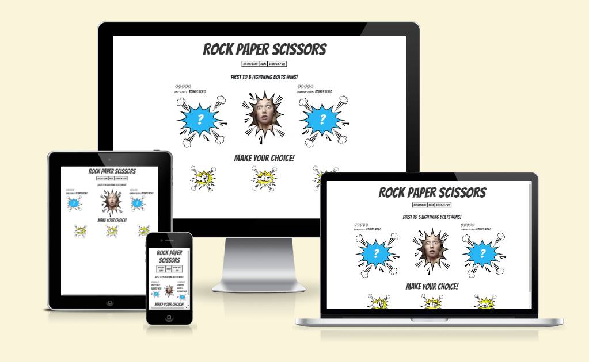

[Click Here To Visit Live Site](https://adrianskelton.github.io/project-2/)

---

## Table of Contents

- [Rock Paper Scissors Javascript game](#rock-paper-scissors-javascript-game)
- [Table of Contents](#contents)
- [User stories](#user-stories)
- [Target Audience](#target-audience)
- [Visitor Goals](#visitor-goals)
- [Design](#design)
- [Colour Scheme](#colour-scheme)
- [Typography](#typography)
- [Imagery](#imagery)
- [Wireframes](#wireframes)
- [Desktop view - start-up screen](#desktop-view---start-up-screen)
- [Desktop view - start-up screen](#desktop-view---startup-screen-1)
- [Mobile view](#mobile-view)
- [Tablet view](#tablet-view)
- [Features](#features)
- [General features on each page](#general-features-on-each-page)
- [Footer with icons](#footer-with-icons)
- [Features by page](#features-by-page)
- [Landing page](#landing-page)
- [Future Implementations](#future-implementations)
- [Accessibility](#accessibility)
- [Technologies Used](#technologies-used)
- [Languages Used](#languages-used)
- [Frameworks, Libraries \& Programs Used](#frameworks-libraries--programs-used)
- [Deployment \& Local Development](#deployment--local-development)
- [Deployment](#deployment)
- [Local Development](#local-development)
- [How to Clone](#how-to-clone)
- [How to Fork](#how-to-fork)
- [Testing](#testing)
- [Manual Testing](#manual-testing)
- [Jigsaw CSS Validator](#jigsaw-css-validator)
- [W3C Validator](#w3c-validator)
- [Lighthouse](#lighthouse)
- [Index page](#index-page)
- [Full Testing](#full-testing)
- [Credits](#credits)
- [Code Used](#code-used)
- [Content](#content)
- [Media](#media)
- [Acknowledgments](#acknowledgments)

---

# User Stories

## Target Audience

The target audience simply is anyone wanting to play an easy to understand game of rock, paper, scissors.

#### Visitor goals

- As a user, I want to be able to recognise what the game is.
- As a user, I want to easily understand the concepts of the game.
- As a user, I want to know my score vs the computer score.
- As a user, I want to navigate the games controls easily.
- As a user, I want to easily see who is winning.

## Design

### Colour Scheme

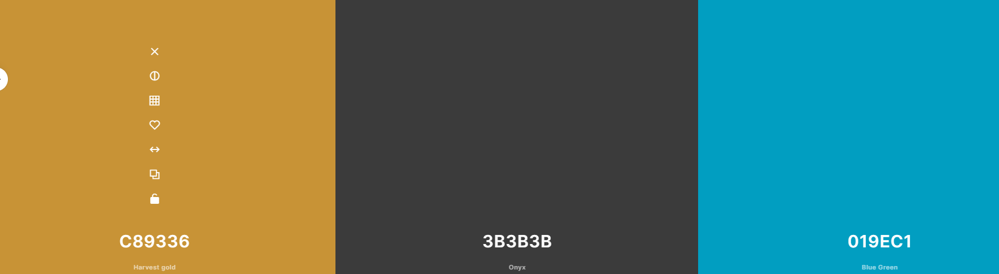

The colour scheme is very basic with two major colours blue and yellow for the graphics. This was to keep the game from looking too busy, especially on smaller devices which makes it easier to navigate and separate the different sections.

### Typography

I went for a google font Bangers because it looked clean and modern and was easy to setup. Below is a screenshot of the font.

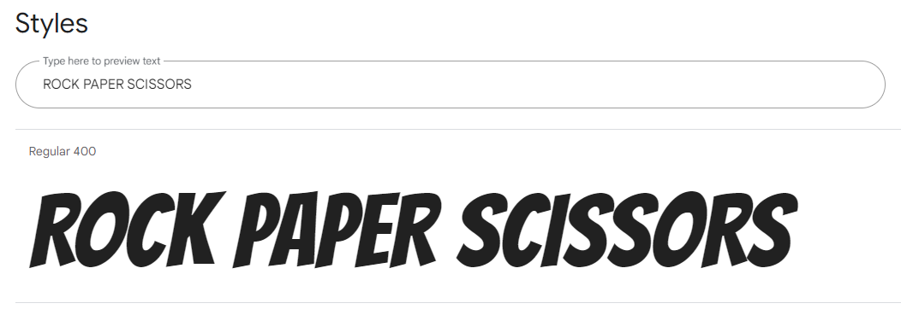 

### Imagery

Due to the nature of the project it is not image intensive however I sourced images for the girls reactions in the vs tab from pexels, I thought it would make the game more interactive and quirky with her expression changing if the user lost or won. I tried to display old school comic book style images. I edited all the images that I sourced using photoshop.

### Wireframes

### Desktop view - start-up screen

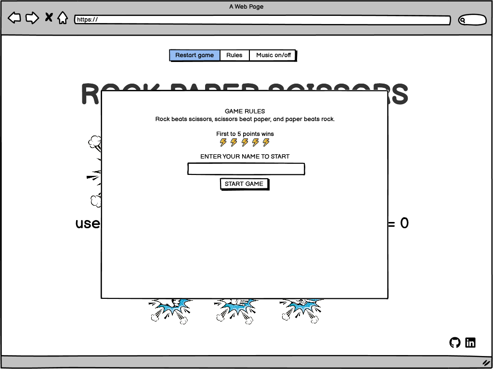 

### Desktop view - the first screen shown to the user when the page loads (shown above). The footer was later taken off in the actual to make the game look less busy

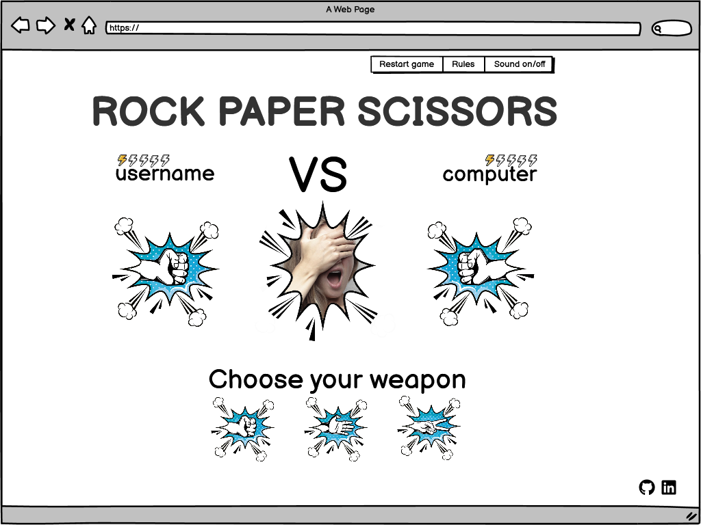 

### Desktop view - game screen (shown above)

___

### Mobile view

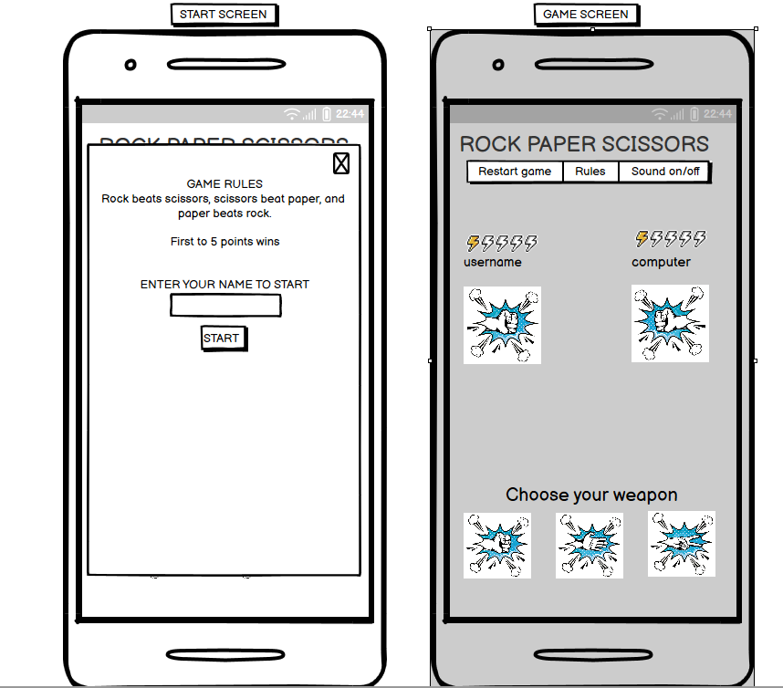 
Start screen (above left) In game screen (above right)

### Tablet view

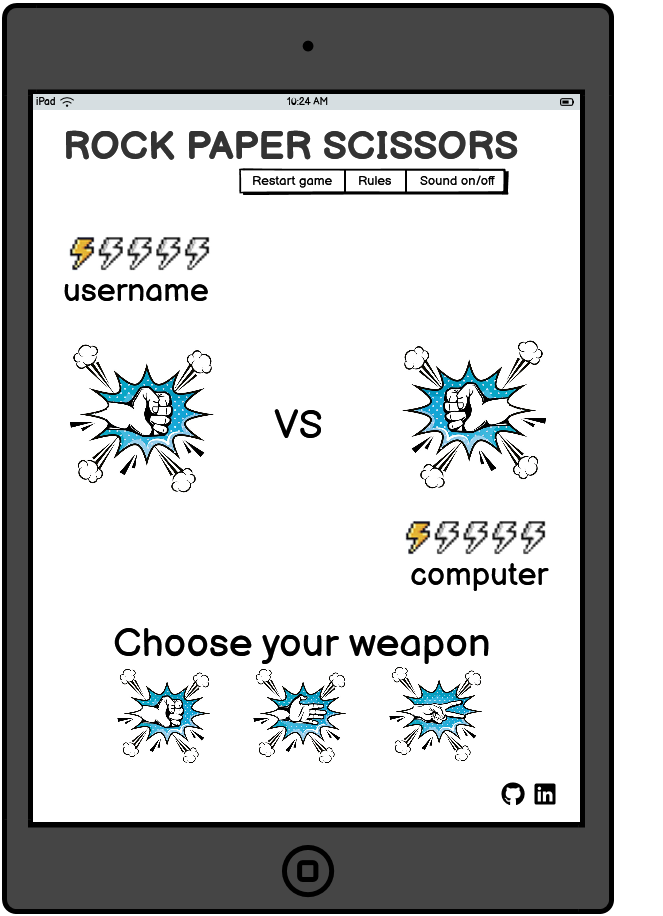 

I used Balsamiq to design my wireframes.

## Features

### Landing page

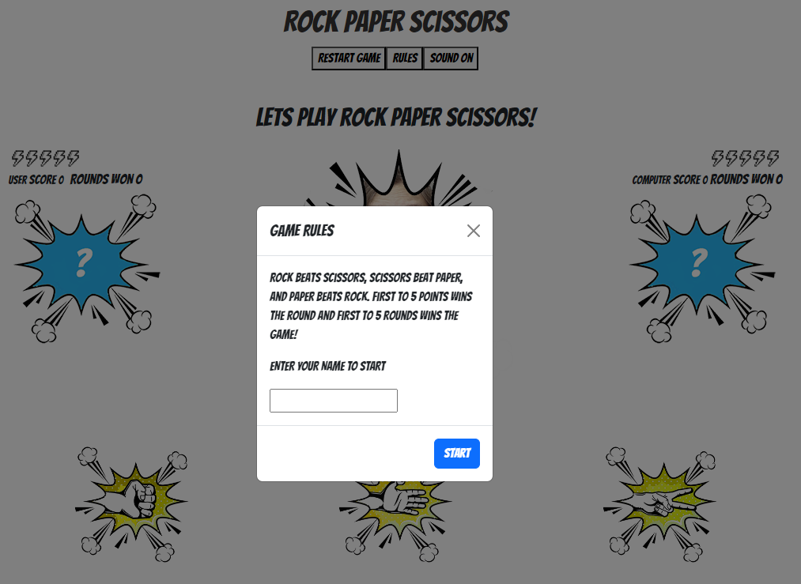 

The game is only one page with a popup modal automatically set to appear when the page is loaded. The modal contains the rules of the game and a text area for the player to enter their name.

### Popup modal with rules and form for players name

This is a bootstrap modal that pops up automatically on the loading of the homepage.
The user can read the rules of the game in the modal and then enter their name to start.

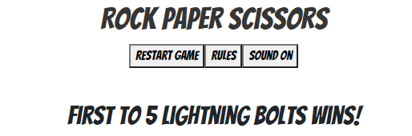 

### Top menu bar

This contains 3 buttons of:

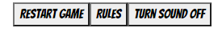

### Restart game button

The restart game button resets all the variables to their start stage.
Namely:

- The round score and game score to zero of both player and computer.
- The lightning bolt images of both player and computer.
- The computer choice and user choice image resets to a question mark image.
- The image of the girls face resets to the start image.
- The text above the girl face image resets to the text 'Lets play rock paper scissors!'
- The user name if entered does not change, only refreshing the page does that, thereby popping up the modul and prompting the user to enter a name again.

### Rules button

When the user clicks on the rules button a popup similar to the one at the start pops up with the game rules. The only difference is there is no form requiring a username.

"Sound on/off" toggle button.

This button toggles between a "sound on" and a "sound off" state, muting the two mp3 files listed at the bottom of the html.
The text then reflects what the user should push on or off for their desired choice.

___

### User game score, round score and lightning bolt

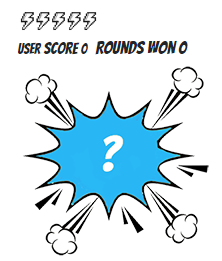.\
Start View when the user has not yet chosen anything and the score is zero (shown above)

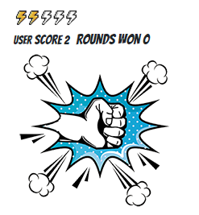.\
In game-play view with lightning bolts that reflect the score. (shown above)

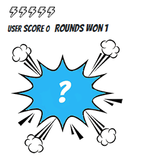.\
Games one view with lightning bolts that reflect the score. (shown above)

### Computer game score, round score and lightning bolt

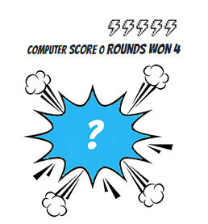.\
The exact same block is shown on the opposite side of the screen, the only difference is the word computer instead of the user name.
No more screenshots added of this image changing as it is the same as the users functionality and would be redundant.

### Changing facial expression image with appropriate text of who wins and how

There are 4 different states of the images, static when the game starts, a win, a lose and a draw.
Each of these are reflected in the text above the image and the girls expression to match.
These images are shown below.

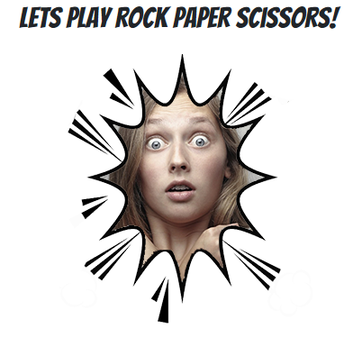.\
Static image (shown above)

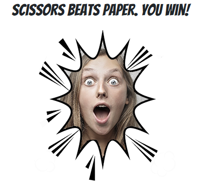.\
Win image (shown above)

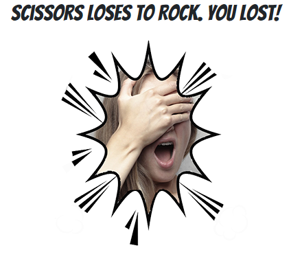.\
Player Loses image (shown above)

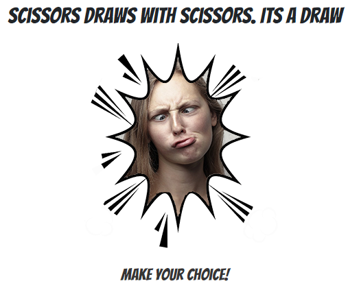.\
Draw image (shown above)

### The 3 option images for the player to select: rock, paper or scissors

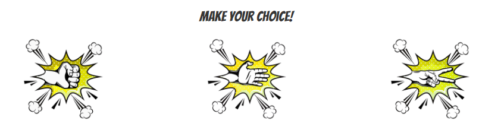

### Two alert boxes for a win or a lose

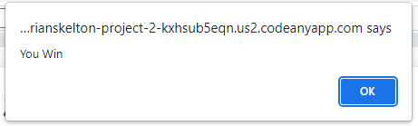

___

### Future Implementations

- A scoreboard that logs the username and their score will be later implemented.
- More options could later be added to the game such as spock and lizard.
- A button option to share the game on Facebook and other platforms.
- The popup modal at the start needs to be improved so if the username is missing they are not allowed to play, and that the player can push enter after entering their name instead of clicking on the button.
- When the player hovers over the selection images of rock paper or scissors they will have a css animation.
- The alert boxes when a user wins or loses could be replaced with better looking popup modals.

### Accessibility

Added aria labels where needed.

___

## Technologies Used

**Github** - Used for storage of my site and for publishing online.\
**Codeanywhere** - The IDE used for editing my site and pushing changes.\
**Python** - Used python 3 via terminal to preview my site using a local http server.\
**HTML5** - The core of the site was built with HTML version 5.\`
**Javascript** - Javascript was responsible for all the functionality and interactivity of the website.\
**CSS** - CSS was used to style the website and define fonts and layout.\
**Bootstrap** - Bootstrap was used for the modal, grid system and columns.\
**Google Chrome** - The website was built and tested in google Chrome with developer tools being used.\
**TinyPNG Website** - Used to compress images so they load faster.\
**Codebeautify Website** - Used to clean up css and html code\
**Favicon Generator Website** - Converted PNG file that I made from the logo using photoshop and converted it into a favicon on website favicon.io\
**coolors.co** - Website used for the colour pallete.\
**Lighthouse in chrome - Used to see the performance of the site.\

### Languages Used

HTML, CSS, Javascript.

### Frameworks, Libraries & Programs Used

**Bootstrap** - for the responsiveness of the website despite having to add a media query for the 1000px breakpoint so that the site looked better on mobile and tablets. I also used bootstrap code for the navbar.\
**Github** - I used GitHub for the storage of my site and Gitpages to pubish my website.\
**Photoshop** - Used photoshop for some of my image resizing and editing of the images.\

___

## Deployment & Local Development

### Deployment

I deployed everything my website onto gitpages.

### Local Development

#### How to Clone

1. Log into your account on github
2. Go to the repository of this project /adrianskelton/Project-2/
3. Click on the code button, and copy your preferred clone link.
4. Open the terminal in your code editor and change the current working directory to the location you want to use for the cloned directory.
5. Type 'git clone' into the terminal, paste the link you copied in step 3 and press enter.

#### How to Fork

To fork the repository:

1. Log in (or sign up) to Github.
2. Go to the repository for this project, adrianskelton/Project-2
3. Click the Fork button in the top right corner.

## Testing

## Manual Testing

### W3C Validator

[W3C](https://validator.w3.org/) was used to validate the HTML of website.

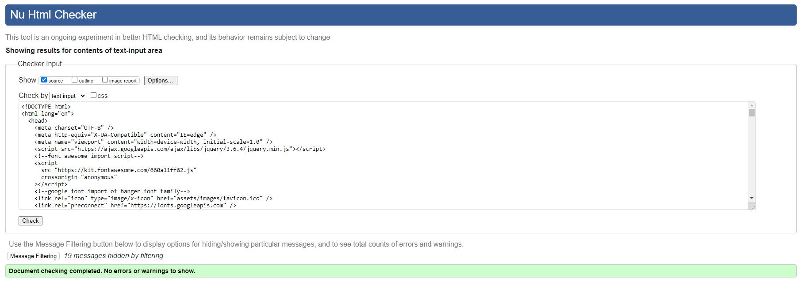 - HTML Pass

___

### Jigsaw CSS Validator

[Jigsaw](https://jigsaw.w3.org/css-validator/validator) was used to validate the css code

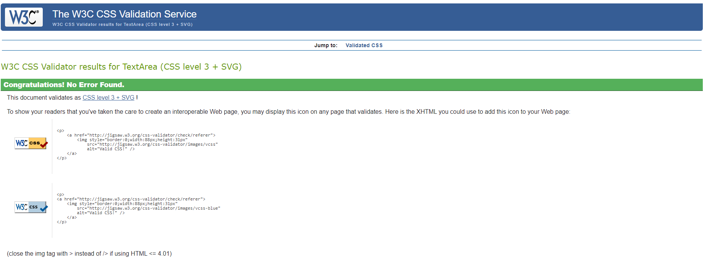 - CSS Pass

### Lighthouse

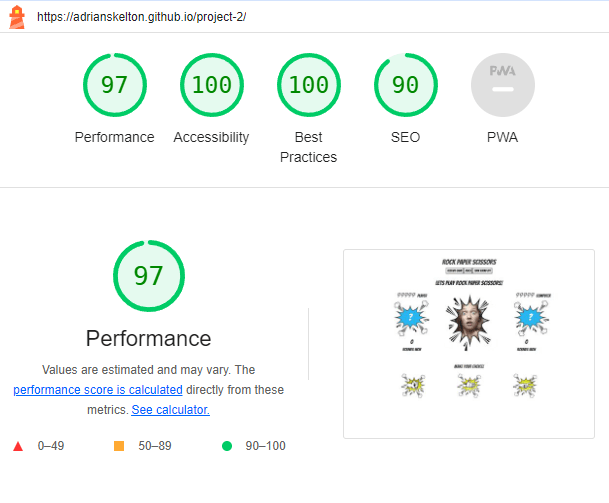

### JSHINT

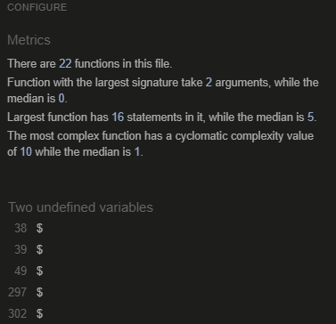

### Full Testing

Full testing was performed on the following devices:

- Laptop:
- Huawei Matebook D
- Mobile Devices:
- iPhone 10
- Google pixel 5

Each device tested the site using the following browsers:

- Google Chrome
- Safari
- Firefox

Additional testing was taken by friends on a variety of devices and screen sizes.

| Feature | Expected Outcome | Testing Performed | Result | Pass/Fail |
| ----------------- | --------------------------------------------------------------------------------------------------------------------- | ---------------------- | ------------------------------------ | --------- |
| |
| | | | | |
| Game title | This remains static and unclickable if a user wants the game to reset that can be done using the rest button instead. | Clicked Logo and title | Nothing happens. | Pass |
| Start-up Popup modal | Pops up on page load and when the user enters the name and clicks on the button the name is stored and reflected in the game on the scoreboard. | Entered name and clicked button | Name now shows on the scoreboard. | Pass |
| Restart game | When clicked during play everything will be reset to the start page, score, images etc. | Clicked on restart button | Everything reset to default state. |Pass |
| Sound toggle button | When clicked the sound will turn off for the game and the button text will turn to 'Sound On' When clicked again the sound will then return and the button text will revert to 'Sound Off'. | Clicked button | Performed as expected | Pass |
| Yellow images of rock, paper and scissors | When clicked they will result in the scores changing, the girls expression, the text of who wins or loses, the blue images of the choices will also change as well as the lightning bolts until the game is won. | Tested each image individually until a win or loss was the result | Preformed as expected | Pass |

---

## Bugs

The lightning bolts do not reach the 5th bolt for some reason. Even though it reflects it in the score, needs to be fixed.
The scores do not align on the computer side.

## Credits

### Code Used

Tutorial I based my game on... <https://www.youtube.com/watch?v=jaVNP3nIAv0>
Tip to over-ride bootstrap modal css <https://stackoverflow.com/questions/20854035/is-it-possible-to-customize-style-of-bootstrap-modal>
Help aligning entire html to centre <https://stackoverflow.com/questions/6464592/how-to-align-entire-html-body-to-the-cente>
When I was stuck I referred to help from w3schools to figure it out <https://www.w3schools.com/>

### Content

Sound effects used for the loss <https://mixkit.co/free-sound-effects/lose/>
Sound effects used for the win <https://pixabay.com/sound-effects/8-bit-victory-sound-101319/>

### Media

Girls facial expression from pixel website <https://www.pexels.com/photo/collage-photo-of-woman-3812743/>

Hand Gestures image <https://img.freepik.com/free-vector/hand-wrist-gesture-black-engraving-icon-set-with-thumb-up-down-fist-middle-finger-other-gestures-vector-illustration_1284-74114.jpg?t=st=1694768463~exp=1694769063~hmac=9ad88b1414c8b4c9f95ba60a21de19bceb648546784d80ecab60baffd1850111>
(Excuse the direct link to the image above but the sharing link on the website did not work)

Frame image used for hand gestures
<https://www.vecteezy.com/vector-art/1952391-explosion-pop-art-style-icon>

### Acknowledgments

I would like to thank my mentor Narender as well as all the users on slack for all their opinions and code reviews.
