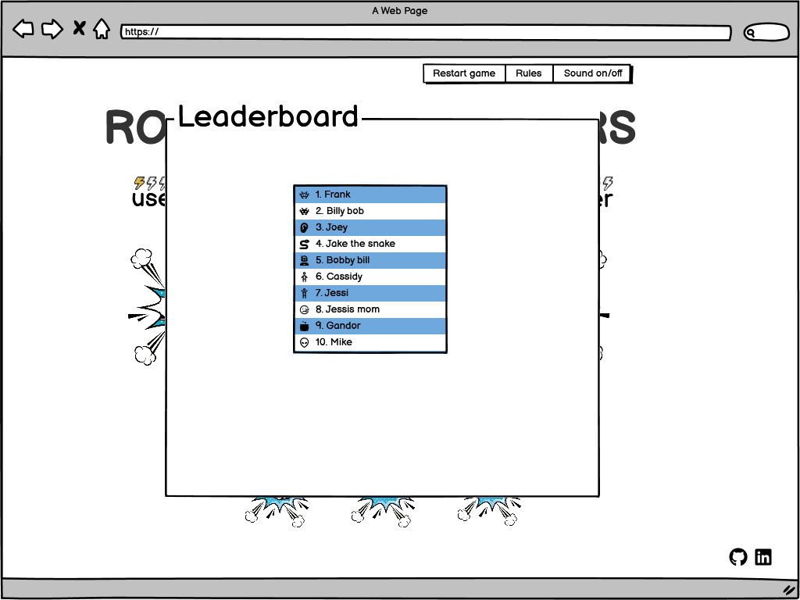

# Rock Paper Scissors Javascript game

This is a javascript game of rock paper scissors,

---

## CONTENTS

- [Rock Paper Scissors Javascript game](#rock-paper-scissors-javascript-game)
  - [CONTENTS](#contents)
  - [Target Audience](#target-audience)
  - [User stories](#user-stories)
    - [want to enjoy the game and know how to play it](#want-to-enjoy-the-game-and-know-how-to-play-it)
  - [Design](#design)
    - [Colour Scheme](#colour-scheme)
    - [Typography](#typography)
    - [Imagery](#imagery)
    - [Wireframes](#wireframes)
    - [Desktop view - startup screen](#desktop-view---startup-screen)
    - [Desktop view - startup screen](#desktop-view---startup-screen-1)
    - [Mobile view](#mobile-view)
    - [Tablet view](#tablet-view)
  - [Features](#features)
    - [General features on each page](#general-features-on-each-page)
    - [Footer with icons](#footer-with-icons)
  - [Features by page](#features-by-page)
    - [Landing page](#landing-page)
    - [Future Implementations](#future-implementations)
    - [Accessibility](#accessibility)
  - [Technologies Used](#technologies-used)
    - [Languages Used](#languages-used)
    - [Frameworks, Libraries \& Programs Used](#frameworks-libraries--programs-used)
  - [Deployment \& Local Development](#deployment--local-development)
    - [Deployment](#deployment)
    - [Local Development](#local-development)
      - [How to Clone](#how-to-clone)
      - [How to Fork](#how-to-fork)
  - [Testing](#testing)
  - [Manual Testing](#manual-testing)
    - [Jigsaw CSS Validator](#jigsaw-css-validator)
    - [W3C Validator](#w3c-validator)
    - [Lighthouse](#lighthouse)
    - [Index page](#index-page)
    - [Full Testing](#full-testing)
  - [Credits](#credits)
    - [Code Used](#code-used)
    - [Content](#content)
    - [Media](#media)
    - [Acknowledgments](#acknowledgments)

---

## Target Audience

Anyone wanting to play the game of rock paper scissors

#### Visitor goals

- The main goal is to let the user play rock paper scissors.
- The user should understand the rules of the game and play it easily.
- The user should ee able to easily navigate the controls of the game.
- The user should be able to see their score on the scoreboard if they get a good score.
- The user should be able to restart the game.

## Design

### Colour Scheme

The color scheme is very basic with two major colors dark grey for the text and blue for the graphics. This was to keep the game from looking to busy espesially on smaller devices.

 

### Typography

I went for a google font Bangers because it looked clean and modern and was easy to setup. Below is a screenshot of the font.

 

### Imagery

Due to the nature of the project it is not image intensive however I sourced images for the girls reactions in the vs tab from pexels, I thought it would make the game more interactive and quirky with her expession changing if the user lost or won. I tried to display old school comic book style images. I edited all the images that I sourced using photoshop.

### Wireframes

### Desktop view - startup screen

 

### Desktop view - game screen

 

### Desktop view - game screen

 

### Mobile view

 

### Tablet view

 

I used Balsamiq to design my wireframes.

## Features

### General features on each page

Top menu bar with "Restart game", "Rules" and "Sound on/off" functions

### Footer with icons

## Features by page

### Landing page

The Landing page has the game layout

### Future Implementations

### Accessibility

## Technologies Used

**Github** - Used for storage of my site and for publishing online.\
**Codeanywhere** - The IDE used for editing my site and pushing changes.\
**Python** - Used python 3 via terminal to preview my site using a local http server.\
**HTML5** - The core of the site was built with HTML version 5.\
**CSS** - CSS was used to style the website and define fonts and layout.\
**Bootstrap** - Bootstrap was used to align items and create items such as the Navbar, accordion, carosel, flipcards, forms etc.\
**Google Maps** - Google maps embed from Google inc.\
**Youtube** - Videos embedded from Youtube.\
**Font Awesome** - Social Media icons from Font Awesome.\
**Google Chrome** - The website was built and tested in google Chrome.\
**TinyPNG Website** - Used to compress images so they load faster.\
**Codebeautify Website** - Used to clean up css and html code\
**Favicon Generator Website** - Converted PNG file that I made from the logo using photoshop and converted it into a favicon on website favicon.io\

### Languages Used

HTML, CSS, Javascript

### Frameworks, Libraries & Programs Used

**Bootstrap** - for the responsiveness of the website despite having to add a media query for the 1000px breakpoint so that the site looked better on mobile and tablets. I also used bootstrap code for the navbar.\
**Github** - I used GitHub for the storage of my site and Gitpages to pubish my website.\
**Photoshop** - Used photoshop for some of my image resizing.

## Deployment & Local Development

### Deployment

I deployed everything my website onto gitpages.

### Local Development

#### How to Clone

1. Log into your account on github
2. Go to the repository of this project /adrianskelton/Project-2/
3. Click on the code button, and copy your preferred clone link.
4. Open the terminal in your code editor and change the current working directory to the location you want to use for the cloned directory.
5. Type 'git clone' into the terminal, paste the link you copied in step 3 and press enter.

#### How to Fork

To fork the repository:

1. Log in (or sign up) to Github.
2. Go to the repository for this project, adrianskelton/Project-2
3. Click the Fork button in the top right corner.

## Testing

## Manual Testing

### Jigsaw CSS Validator

[Jigsaw](https://jigsaw.w3.org/css-validator/validator) was used to validate the css code
 - Pass

### W3C Validator

[W3C](https://validator.w3.org/) was used to validate the HTML on all pages of the website. It was also used to validate the CSS.

 - Pass
 - Pass

### Lighthouse

### Index page

### Full Testing

Full testing was performed on the following devices:

- Laptop:
  - Huawei matebook D
- Mobile Devices:
  - iphone 10
  - Google pixel 5

Each device tested the site using the following browsers:

- Google Chrome
- Safari
- Firefox

Additional testing was taken by friends on a variety of devices and screen sizes.

| Feature                     | Expected Outcome                                                   | Testing Performed      | Result                               | Pass/Fail |
| --------------------------- | ------------------------------------------------------------------ | ---------------------- | ------------------------------------ | --------- |
| `Navbar`                    |
|                             |                                                                    |                        |                                      |           |
| Mountain Magic Logo & Title | When clicked the user will be redirected to the home page.         | Clicked Logo and title | Redirected to the home page.         | Pass      |
| Home Page Link              | When clicked the user will be redirected to the home page.         | Clicked link           | Redirected to the home page.         | Pass      |
| Accomodation Link           | When clicked the user will be redirected to the accomodation page. | Clicked link           | Redirected to the accomodation page. | Pass      |
| Contact Link                | When clicked the user will be redirected to the Contact page.      | Clicked link           | Redirected to the contact page       | Pass      |
| ---                         | ---                                                                | ---                    | ---                                  | ---       |

---

## Bugs

When username is entered in modal userimage dissapears

## Credits

### Code Used

### Content

###  Media

Hand Gestures image <https://www.freepik.com/free-vector/hand-wrist-gesture-black-engraving-icon-set-with-thumb-up-down-fist-middle-finger-other-gestures-vector-illustration_26766099.htm#query=fist%20gesture&position=0&from_view=keyword&track=ais>

Frame image used for hand gestures
<https://img.freepik.com/free-vector/fight-club-logo-set-vintage-monochrome-emblems-with-arm-clenched-fist-medal-ribbon-vector-illustration-collection-boxing-kickboxing-martial-arts-club-labels_74855-8368.jpg?size=626&ext=jpg&ga=GA1.2.1255192767.1692352642&semt=ais>

###  Acknowledgments

I would like to thank my mentor Narender as well as all the users on slack for all their opinions and code reviews.
